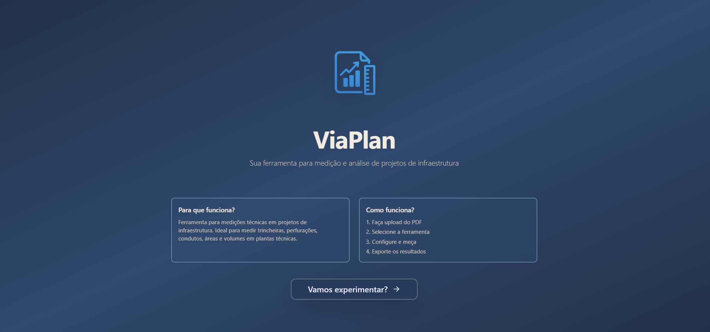

# ViaPlan

**Sua ferramenta para medição e análise de projetos de engenharia civil predial**



Sistema completo de levantamento de quantitativos (Takeoff) para engenharia civil predial. Permite realizar medições precisas diretamente sobre plantas digitais em PDF, com cálculos automáticos de áreas, volumes e distâncias em projetos residenciais e comerciais.

## Para que funciona?

Ferramenta para medições técnicas em projetos de construção predial (casas e edifícios). Ideal para medir paredes, áreas, vãos, lajes, fundações, estruturas, acabamentos e coberturas em plantas arquitetônicas.

## Como funciona?

1. Faça upload do PDF
2. Selecione a ferramenta
3. Configure e meça
4. Exporte os resultados

## Índice

- [Sobre o Projeto](#sobre-o-projeto)
- [Funcionalidades](#funcionalidades)
- [Tecnologias](#tecnologias)
- [Instalação e Configuração](#instalação-e-configuração)
- [Como Usar](#como-usar)
- [Arquitetura](#arquitetura)
- [Backend](#backend)
- [Estrutura do Projeto](#estrutura-do-projeto)
- [Desenvolvimento](#desenvolvimento)

## Sobre o Projeto

O **ViaPlan** é uma solução de engenharia assistida por computador (CAE) projetada para orçamentistas e engenheiros realizarem levantamentos de materiais e quantitativos diretamente sobre plantas digitais (PDF).

O sistema combina um Canvas Interativo de alta performance com ferramentas de desenho vetorial, permitindo cálculos automáticos baseados na escala do projeto, seguindo os padrões brasileiros de engenharia civil.

### O que foi desenvolvido

- Visualizador de PDF integrado com navegação fluida
- Sistema de escalas métricas padrão (1:1000, 1:500, 1:200, 1:100)
- Calibração manual de escala com medição de dois pontos
- Ferramentas especializadas de medição para construção predial (paredes, áreas, vãos, lajes, fundações, estruturas, acabamentos, coberturas)
- Cálculos automáticos de área, volume e distância
- Interface responsiva e moderna com suporte a modo escuro
- Sistema de exportação (CSV, JSON)
- Histórico de ações (Undo/Redo)
- Gestão de projetos e plantas
- Sistema de autenticação integrado

## Funcionalidades

### 1. Visualização e Manipulação de Plantas

#### Visualizador de PDF
- Renderização de plantas de alta resolução
- Navegação entre páginas com controles intuitivos
- Zoom (0.5x a 3x) com controles de zoom in/out
- Pan (arrastar) para navegação no documento
- Interface de erro compacta e funcional

#### Sistema de Escalas
- **Escalas Métricas Padrão** (conforme padrões brasileiros):
  - `1:1000` - Redes subterrâneas, infraestrutura urbana
  - `1:500` - Detalhamento médio
  - `1:200` - Detalhamento de elementos
  - `1:100` - Detalhes construtivos
- **Escala Manual**: Calibração personalizada
  - Clique em dois pontos com distância conhecida
  - Sistema calcula automaticamente a escala
  - Suporte a múltiplas unidades (m, cm, mm, ft, in, yd)

### 2. Ferramentas de Medição

O sistema oferece ferramentas especializadas para engenharia civil predial, acessíveis via barra lateral:

#### Ferramentas Disponíveis

- **Selecionar**: Mover, redimensionar, apagar, agrupar e filtrar medições. Não mede, apenas edita.
- **Planta / Layout**: Medições de paredes, eixos, espessuras, alinhamentos e perímetros internos.
- **Paredes**: Traçado, altura, espessura, área de alvenaria e estimativa de blocos/argamassa (parâmetros configuráveis).
- **Área**: Polígonos, área útil/bruta, lajes e ambientes. Exportação em tabela.
- **Vãos e Aberturas**: Portas, janelas e vãos. Dimensões, material e quantidade.
- **Lajes / Pisos**: Medições de superfícies com espessura. Volume de concreto ou área de revestimento.
- **Fundação**: Sapatas, blocos e vigas baldrame. Dimensões, volume e parâmetros estruturais mínimos.
- **Estrutura (Concreto)**: Vigas, pilares e lajes. Cálculo por seção e volume.
- **Acabamentos**: Pisos, revestimentos e pintura. Área, perdas configuráveis e tipo de material.
- **Cobertura**: Áreas inclinadas, telhados e platibandas. Inclinação, área real e área projetada.
- **Nota**: Texto livre, metadados e localização.

### 3. Configuração Paramétrica

Cada ferramenta possui modais de configuração avançada:

- **Paredes**: Altura, espessura, tipo de alvenaria, estimativa de blocos e argamassa
- **Área**: Configuração de área útil/bruta, altura opcional para cálculo de volume
- **Vãos e Aberturas**: Dimensões, material, quantidade e tipo (porta/janela)
- **Lajes / Pisos**: Espessura, tipo de concreto, área de revestimento
- **Fundação**: Dimensões, volume, parâmetros estruturais mínimos
- **Estrutura**: Seções transversais, volume de concreto, armaduras
- **Acabamentos**: Tipo de material, perdas configuráveis, área de cobertura
- **Cobertura**: Inclinação, área real, área projetada, tipo de telhado

### 4. Gestão de Dados e Workflow

#### Cálculos Automáticos
O sistema gera um resumo em tempo real contendo:
- Comprimento total (m)
- Área total (m²)
- Volume total (m³)
- Resumo por tipo de medição
- Estimativas de materiais (blocos, argamassa, concreto, etc.)

#### Histórico de Ações
- Sistema robusto de **Undo/Redo** (Desfazer/Refazer)
- Suporte para ações de medição, zoom e configuração
- Botão de desfazer sempre visível na barra de ferramentas

#### Exportação
- **CSV**: Exportação para planilhas
- **JSON**: Exportação para integração com outros sistemas
- Dados incluem todas as medições com suas configurações

### 5. Interface do Usuário

#### Design Moderno
- Interface responsiva (mobile, tablet, desktop)
- Suporte a modo escuro
- Tema customizado com paleta de cores profissional
- Animações suaves e feedback visual

#### Barra de Ferramentas
- Upload de PDF
- Seletor de escala com opções padrão e manual
- Controles de zoom (in/out)
- Botão de desfazer
- Exibição fixa da escala atual
- Botões de exportação (CSV, JSON)

#### Visualizador
- Barra de navegação fixa no topo
- Controles de página (anterior/próxima)
- Área de visualização responsiva
- Canvas de medições sobreposto ao PDF

## Tecnologias

### Frontend

#### Core
- **React 18** - Biblioteca JavaScript para construção de interfaces
- **TypeScript** - Tipagem estática para JavaScript
- **Vite** - Build tool e dev server de alta performance

#### UI e Estilização
- **Tailwind CSS** - Framework CSS utility-first
- **Radix UI** - Componentes acessíveis e sem estilo
- **Lucide React** - Biblioteca de ícones moderna
- **Framer Motion** - Animações e transições

#### Gerenciamento de Estado
- **Zustand** - Gerenciamento de estado global leve
- **React Query (TanStack Query)** - Gerenciamento de estado do servidor e cache

#### PDF e Canvas
- **react-pdf** - Renderização de PDFs em React
- **pdfjs-dist** - Biblioteca PDF.js para processamento de PDFs
- **HTML5 Canvas** - Renderização de gráficos e medições

#### Formulários e Validação
- **React Hook Form** - Gerenciamento de formulários performático
- **Zod** - Validação de schemas TypeScript-first
- **@hookform/resolvers** - Integração React Hook Form + Zod

#### Roteamento
- **React Router DOM** - Roteamento client-side

#### Outras Bibliotecas
- **react-dropzone** - Upload de arquivos com drag & drop
- **date-fns** - Manipulação de datas
- **recharts** - Gráficos e visualizações
- **tesseract.js** - OCR (reconhecimento óptico de caracteres)
- **sonner** - Sistema de notificações toast

### Desenvolvimento

#### Linting e Formatação
- **ESLint** - Linter JavaScript/TypeScript
- **Prettier** - Formatador de código
- **TypeScript ESLint** - Regras específicas para TypeScript

#### Testes
- **Jest** - Framework de testes unitários
- **React Testing Library** - Testes de componentes React
- **Playwright** - Testes end-to-end

#### Build Tools
- **Vite** - Build tool
- **TypeScript Compiler** - Compilação TypeScript
- **PostCSS** - Processamento CSS
- **Autoprefixer** - Prefixos CSS automáticos

## Instalação e Configuração

### Pré-requisitos

- **Node.js** >= 18.0.0
- **npm** ou **yarn** ou **pnpm**

### Instalação

1. Clone o repositório:
```bash
git clone <repository-url>
cd ViaPlan
```

2. Instale as dependências:
```bash
npm install
```

3. Configure as variáveis de ambiente:
Crie um arquivo `.env` na raiz do projeto:
```env
VITE_API_BASE_URL=https://viaplan-backend.onrender.com/
```

4. Inicie o servidor de desenvolvimento:
```bash
npm run dev
```

5. Acesse a aplicação:
```
http://localhost:5173
```

### Scripts Disponíveis

```bash
# Desenvolvimento
npm run dev          # Inicia servidor de desenvolvimento

# Build
npm run build        # Compila para produção
npm run preview      # Preview do build de produção

# Qualidade de Código
npm run lint         # Executa ESLint
npm run format       # Formata código com Prettier
npm run type-check   # Verifica tipos TypeScript

# Testes
npm run test         # Executa testes unitários
npm run test:e2e     # Executa testes end-to-end
```

## Como Usar

### 1. Upload de PDF

1. Clique no botão **"Upload"** na barra de ferramentas
2. Selecione um arquivo PDF ou arraste e solte
3. Aguarde o carregamento do PDF

### 2. Configurar Escala

#### Escala Padrão
1. No seletor de escala, escolha uma das opções:
   - `1:1000` - Para projetos de infraestrutura urbana
   - `1:500` - Para detalhamento médio
   - `1:200` - Para elementos específicos
   - `1:100` - Para detalhes construtivos

#### Escala Manual
1. Selecione **"Escala Manual"** no seletor
2. No modal que abrir:
   - Digite o comprimento real conhecido (ex: 10m)
   - Selecione a unidade (m, cm, mm, etc.)
   - Clique em **"Medir"** e desenhe no PDF a distância correspondente
   - Clique em **"Calibrar Escala"** para finalizar

### 3. Realizar Medições

1. Selecione uma ferramenta na barra lateral:
   - **Planta / Layout**: Para medições gerais de layout
   - **Paredes**: Para medir paredes e alvenaria
   - **Área**: Para calcular áreas de ambientes e lajes
   - **Vãos e Aberturas**: Para portas e janelas
   - **Lajes / Pisos**: Para lajes e pisos com espessura
   - **Fundação**: Para sapatas, blocos e vigas baldrame
   - **Estrutura**: Para vigas, pilares e lajes estruturais
   - **Acabamentos**: Para pisos, revestimentos e pintura
   - **Cobertura**: Para telhados e áreas inclinadas
   - **Nota**: Para observações e anotações

2. Configure os parâmetros no modal que aparecer

3. No PDF, clique e arraste para desenhar a medição

4. A medição será adicionada automaticamente com os cálculos

### 4. Navegar no PDF

- **Zoom In/Out**: Use os botões `+` e `-` na barra de ferramentas
- **Pan**: Arraste o PDF com o mouse (quando nenhuma ferramenta estiver ativa)
- **Navegação de Páginas**: Use as setas `←` `→` na barra superior

### 5. Gerenciar Medições

- **Visualizar**: Todas as medições aparecem na barra lateral direita
- **Deletar**: Clique no `×` ao lado de cada medição
- **Desfazer**: Use o botão de desfazer (↶) na barra de ferramentas

### 6. Exportar Dados

1. Clique em **"Exportar CSV"** ou **"Exportar JSON"**
2. O arquivo será baixado com todas as medições e cálculos

## Arquitetura

### Gerenciamento de Estado

#### Zustand Store
O `takeoffStore` centraliza:
- Lista de medições
- Filtros e seleção
- Cálculo de totais em tempo real
- Persistência de preferências

#### React Query
- Cache inteligente de requisições
- Sincronização automática com o servidor
- Gerenciamento de estado de loading/error

### Camada de Serviço

#### ApiService
- Abstração de comunicação HTTP
- Retry automático em caso de falha
- Tratamento de erros centralizado
- Timeout configurável

#### TakeoffService
- Operações CRUD de takeoffs
- Mapeamento de entidades backend ↔ frontend
- Validação client-side
- Cache local (localStorage)

#### UploadService
- Upload de plantas (PDFs)
- Progress tracking
- Validação de arquivos
- Suporte a múltiplos formatos

### Canvas Engine

#### QuickTakeoffViewer
- Renderização do PDF com react-pdf
- Canvas overlay para medições
- Conversão de coordenadas (tela → projeto)
- Gerenciamento de zoom e pan

#### TakeoffCanvasBase
- Ciclo de vida do desenho (mousedown, mousemove, mouseup)
- Conversão de coordenadas baseada na escala
- Renderização de medições existentes

### Componentes

#### Estrutura Modular
- Componentes UI reutilizáveis em `components/ui/`
- Componentes de negócio em `components/`
- Hooks customizados em `hooks/`
- Serviços em `services/`
- Tipos TypeScript em `types/`

## Backend

O backend foi desenvolvido separadamente e está disponível em:

**[Link do Repositório do Backend](https://github.com/seu-usuario/viaplan-backend)**

### API REST

O frontend se comunica com a API REST do backend através de:

- **Base URL**: Configurável via variável de ambiente `VITE_API_BASE_URL`
- **Autenticação**: Token JWT armazenado em `localStorage`
- **Endpoints principais**:
  - `/plants` - Gerenciamento de plantas
  - `/takeoffs` - Gerenciamento de takeoffs
  - `/measurements` - Medições
  - `/projects` - Projetos

### Configuração da API

Edite o arquivo `src/config/api.ts` ou configure a variável de ambiente:

```env
VITE_API_BASE_URL=https://sua-api.com/api/v1
```

## Estrutura do Projeto

```
ViaPlan/
├── public/                 # Arquivos estáticos
│   └── image/             # Imagens
├── src/
│   ├── components/        # Componentes React
│   │   ├── ui/            # Componentes UI reutilizáveis
│   │   ├── QuickTakeoff/  # Componentes específicos do Takeoff
│   │   └── ...            # Outros componentes
│   ├── hooks/             # Custom hooks
│   ├── services/          # Serviços (API, upload, etc.)
│   ├── stores/            # Zustand stores
│   ├── types/              # Tipos TypeScript
│   ├── utils/              # Funções utilitárias
│   ├── config/             # Configurações
│   ├── App.tsx             # Componente raiz
│   └── main.tsx            # Entry point
├── tests/                  # Testes
├── package.json            # Dependências
├── tsconfig.json          # Configuração TypeScript
├── vite.config.ts         # Configuração Vite
└── tailwind.config.js     # Configuração Tailwind
```

## Desenvolvimento

### Padrões de Código

- **TypeScript**: Tipagem estrita habilitada
- **ESLint**: Regras configuradas para React e TypeScript
- **Prettier**: Formatação automática
- **Conventional Commits**: Padrão de commits

### Contribuindo

1. Crie uma branch para sua feature: `git checkout -b feature/nova-funcionalidade`
2. Faça commit das mudanças: `git commit -m 'feat: adiciona nova funcionalidade'`
3. Push para a branch: `git push origin feature/nova-funcionalidade`
4. Abra um Pull Request

### Melhorias Recentes

- **Refatoração completa do painel de ferramentas**: Migração de ferramentas de infraestrutura para engenharia civil predial
- **Nova lista de ferramentas**: Planta/Layout, Paredes, Área, Vãos e Aberturas, Lajes/Pisos, Fundação, Estrutura, Acabamentos, Cobertura
- **Unidades métricas**: Todas as medições agora usam metros (m), metros quadrados (m²) e metros cúbicos (m³)
- **Caneta de medição estabilizada**: Sistema de dois pontos (início e fim) para medições mais precisas
- **Exibição melhorada de medições**: Cada medida exibe detalhes completos (comprimento, área, volume, dimensões)
- Sistema de escalas métricas padrão (1:1000, 1:500, 1:200, 1:100)
- Calibração manual de escala com medição de dois pontos
- Interface de erro compacta e funcional
- Barra de controles fixa e responsiva
- Exibição fixa da escala atual
- Melhorias na responsividade geral
- Suporte completo a modo escuro

## Licença

Este projeto está sob a licença especificada no arquivo `LICENSE`.

## Autores

Desenvolvido para engenharia civil predial, construção de casas e edifícios.

---

**ViaPlan** - Sistema de Takeoff Digital para Engenharia Civil
